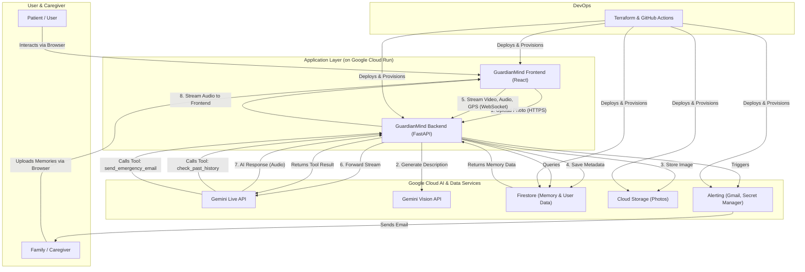

# GuardianMind: Technical Design Document

**Project:** GuardianMind - A Live AI Companion for Alzheimer's Assistance
**Version:** 1.0
**Date:** March 16, 2026

---

## 1. Introduction

### 1.1. Problem Statement

Individuals with memory loss, such as those with Alzheimer's, face significant daily challenges in recognizing familiar people, navigating known places, and maintaining personal safety. This cognitive gap creates a state of constant worry for their caregivers and families, who cannot always be physically present. Existing solutions are often passive, relying on manual lookups or lacking real-time, context-aware assistance.

### 1.2. Proposed Solution

GuardianMind is a real-time, multimodal AI companion designed to bridge this gap. It acts as a persistent, intelligent guardian by processing a live stream of audio and video from the user's device. By leveraging the Google Gemini Live API, GuardianMind combines this live data with a personalized, caregiver-curated knowledge base to:

*   **Proactively identify** the user's surroundings and companions.
*   Provide **contextual memory recall** in a natural, conversational manner.
*   **Detect signs of wandering** using GPS data and automatically alert caregivers in emergencies.

The system is designed to provide a crucial layer of safety, independence, and peace of mind for both the user and their loved ones.

---

## 2. System Architecture

GuardianMind is built on a modern, scalable, and secure cloud-native architecture. The design prioritizes low-latency, real-time communication and robust, automated deployment.

### 2.1. High-Level Architecture Diagram



### 2.2. Data Flow

1.  **Memory Curation (Asynchronous):**
    *   A caregiver uploads a photo and description via the React frontend to a REST API endpoint on the FastAPI backend.
    *   The backend calls the Gemini Vision API to generate a detailed "visual fingerprint" of the image.
    *   The original image is stored in Google Cloud Storage (GCS).
    *   All metadata (user description, AI description, GCS path, etc.) is saved to a user-specific collection in Google Cloud Firestore.

2.  **Live Guardian Session (Real-time):**
    *   The user initiates a session, establishing a WebSocket connection to the backend.
    *   The backend establishes a connection to the Gemini Live API.
    *   The frontend streams audio, video, and GPS data to the backend over the WebSocket.
    *   The backend forwards this data in real-time to the Gemini Live API.
    *   Gemini processes the multimodal input, decides when to speak or call a tool, and streams audio responses back.
    *   When a tool is called (e.g., `check_past_history`), the backend executes the function (e.g., querying Firestore) and sends the result back to Gemini to inform its next action.

---

## 3. Detailed Component Design

### 3.1. Backend (`app-backend/routers/live.py`)

This is the core of the system, orchestrating the live agent session.

#### 3.1.1. AI Persona & Prompt Engineering

The agent's behavior is governed by a meticulously crafted system prompt that defines the **"GuardianMind" persona**. This prompt includes 11 **"CRITICAL BEHAVIORAL RULES"** that ensure the AI is empathetic, safe, and effective.

*   **Key Rules:**
    *   `VISUAL TRUTH`: Prioritizes the live video feed over stored knowledge to prevent hallucinations.
    *   `PROACTIVE SCANNING`: Instructs the AI to analyze its surroundings upon starting or when the scene changes.
    *   `SILENCE IS GOLDEN`: A crucial rule that prevents the AI from being intrusive. If the user is safe and stationary at a known location, the AI remains completely silent unless spoken to.
    *   `SUNDOWNING AWARENESS`: Makes the AI aware of the time of day, prompting it to be extra soothing during late hours when confusion can increase.

#### 3.1.2. Innovation: Proactive Situational Awareness

The system's most innovative feature is its ability to give the AI situational awareness without user input.

1.  The frontend periodically sends GPS coordinates to the backend.
2.  The backend calculates the user's distance from known, saved locations (e.g., "Home").
3.  It injects a **hidden system prompt** into the conversation that is invisible to the user.
    *   **Example:** `[SYSTEM BACKGROUND CONTEXT]: WARNING: The user is wandering FURTHER AWAY from Home. You MUST verbally warn them.`
4.  This allows the AI to intelligently decide whether to **warn** the user, **encourage** them if they are heading back to safety, or remain **silent** if they are safe.

#### 3.1.3. Intelligent Function Calling (Tools)

The AI is empowered with tools to interact with its environment:

*   `check_past_history`: Scans the Firestore memory bank to identify people or places in the live video.
*   `fetch_specific_memory_image`: Pulls the original photo from GCS for direct visual comparison if the AI is uncertain about a match.
*   `save_new_memory`: A user-guided flow to capture a new memory, ensuring the user is always in control.
*   `send_emergency_email`: A critical safety function that dispatches a detailed alert to the caregiver via the Gmail API, including a situation summary, a snapshot from the live video, and a Google Maps link to the user's last known location.

### 3.2. Frontend (`app-ui`)

A React-based single-page application responsible for all user interaction.

*   **Key Screens:** Login/Register, Dashboard, Store Photo, Live Guardian.
*   **Client-Side Technologies:**
    *   **WebSockets:** Manages the persistent, real-time connection to the backend for the live session.
    *   **Web Speech API (`StorePhotos.jsx`):** Used for the "Hold mic to speak" feature, allowing for efficient, on-device voice-to-text transcription without server-side processing.
    *   **Geolocation API:** Periodically fetches the user's GPS coordinates to send to the backend for situational awareness.

### 3.3. Database Schema (Google Cloud Firestore)

A NoSQL structure is used for flexibility and scalability.

```
users/{userId}/
  - name: "John Doe"
  - email: "john.doe@example.com"
  - emergencyEmail: "caregiver@example.com"
  
  photos/{photoId}/
    - userId: "userId"
    - description: "This is the kitchen" (User-provided)
    - geminiDescription: "A kitchen with white cabinets..." (AI-generated)
    - photoDate: "2023-10-26"
    - imageUrl: "photos/userId/photoId.jpg"
    - location: { latitude: 34.05, longitude: -118.24 }
```

---

## 4. Infrastructure and Deployment

The project is designed for fully automated, production-grade deployment.

### 4.1. Infrastructure as Code (Terraform)

The infrastructure is managed declaratively using Terraform, split into two logical parts:

*   **`terraform/`:** Provisions foundational, persistent resources like GCS buckets, Firestore database, Artifact Registry, and core IAM service accounts. This is run infrequently.
*   **`terraform-deploy/`:** Provisions the application services (Cloud Run for UI and Backend). This configuration is run on every deployment to update the services with the latest container images.

### 4.2. CI/CD Pipeline (`.github/workflows/deploy.yml`)

A GitHub Actions workflow automates the entire deployment process on every push to the `main` branch.

1.  **`terraform` job:** Applies any changes to the core infrastructure.
2.  **`changes_check` job:** Uses a path filter to determine if the UI or backend code has changed.
3.  **`build-push-*` jobs:** If code changes are detected, these jobs build new Docker images for the modified components and push them to Google Artifact Registry, tagged with both `latest` and the Git SHA.
4.  **`terraform-deploy` job:** This job runs if any code has changed or if the deployment configuration itself has changed. It applies the `terraform-deploy` configuration, which pulls the `latest` image tag and deploys the new version to Google Cloud Run with zero downtime.

---

## 5. Security Considerations

*   **Authentication:** User authentication is handled via JSON Web Tokens (JWT). The backend validates the token on all protected endpoints and the WebSocket connection.
*   **Authorization:** All database queries are scoped to the authenticated user's ID, ensuring users can only access their own data in Firestore.
*   **Secrets Management:** Sensitive credentials, such as the Gmail API OAuth tokens, are stored securely in **Google Secret Manager**. The Cloud Run service account is granted permission to access these secrets at runtime.
*   **CI/CD Security:** The pipeline currently uses a long-lived service account key (`GCP_SA_KEY`) stored in GitHub Secrets. A recommended future improvement is to migrate to **Workload Identity Federation** for keyless, short-lived authentication from GitHub Actions to Google Cloud.

---

## 6. Testing Strategy

The application's core functionalities can be tested reproducibly using the local development setup.

*   **Memory Curation:**
    1.  Log in as a caregiver.
    2.  Navigate to "Store a Photo" and upload an image with a description and location.
    3.  Verify that the image appears in the GCS bucket and the corresponding metadata document is created in Firestore.

*   **Live Guardian Agent:**
    1.  Log in as the user.
    2.  Navigate to "Live Guardian" and grant camera/microphone permissions.
    3.  Point the camera at the previously saved location and confirm the AI correctly identifies it.
    4.  Simulate a distress call by saying "I need help."
    5.  Verify that the AI responds appropriately and that an emergency email is dispatched to the caregiver's registered address.

---

## 7. Future Work

*   **Caregiver Dashboard:** A dedicated web portal for caregivers to review daily summaries of user activity, transcribed conversations, and triggered alerts.
*   **Wearable Integration:** A native mobile or smartwatch application to allow the GuardianMind agent to run more persistently in the background, offering an "always-on" layer of safety.
*   **Offline Mode:** Caching essential memories and a lightweight model on the device to provide core functionality even in areas with poor or no internet connectivity.
